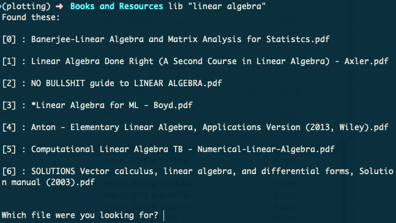

# Fast Digital Library Search
## CLI tool for searching your digital book library

This is a simple command-line tool I wrote in an hour while I probably should have been paying attention in class.

Since the Mac OS's Spotlight search is occasionally bad, forcing me to navigate by GUI to find my books, I thought it would be fun to write up a faster way to search directly from the command line. This has the added benefit of *only* searching your books, so you never have to worry about irrelevant results from other folders.

The tool will open your books in Preview by default, but the flag `-a` will tell it to open in Adobe Acrobat Reader DC, if you have that installed.

Note that **the tool expects PDFs** and I can't guarantee that it will work properly with other filetypes, unless they are natively supported by Preview/Acrobat.

### Dependencies

Requires Python 3.6+ (due to f-strings). No dependencies, this uses only standard library modules. 

### Installation and Usage

Add `search.py` and optionally `do_not_search.txt` to the root directory of your digital library. 

Then, depending on whether you use bash or zsh, you should open your .bashrc file or .zshrc file and add the function below. (This will generally be in your home directory; if you don't see it, use `CMD+SHIFT+.` to reveal hidden files.)

```
function lib() {
    cd ~/Dropbox/"Books and Resources" # REPLACE THIS WITH YOUR DESIRED DIRECTORY
    python search.py $1 $2
}
```

When run, the tool will recursively search your directories and run your query against the list of files. Then it will ask you to choose from a list of results, you type in the number of the book you want, and it will open for you in Preview (or Acrobat).

Example:

`lib "linear algebra"`



**Notes about search functionality:**

- One-word queries can be written without quotes (such as `lib algorithms`), but multiple-word queries will need quotes.
- Searching is currently case-insensitive and exact-match, but I might add fuzzy match support later.

## Excluding Directories

If you'd like to exclude directories, create a do_not_search.txt file with partial or full names of your directories as a newline-separated list, like so:

```
Extraneous Stuff
XXX
Doggos
```
